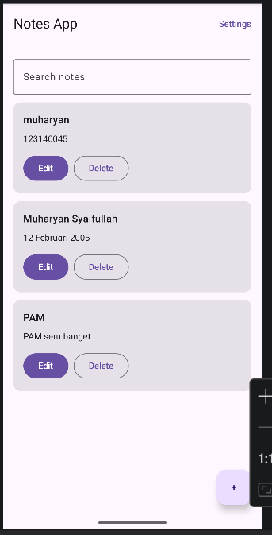
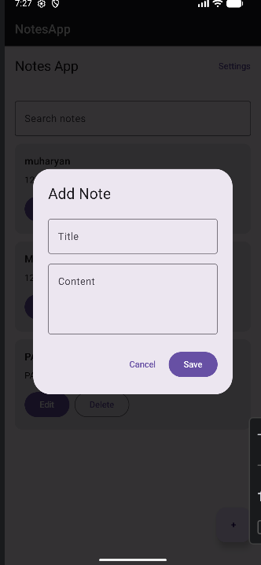
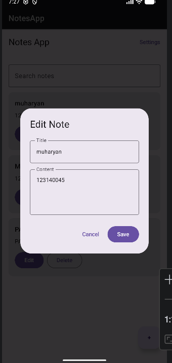
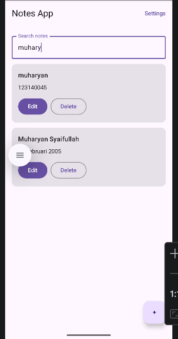
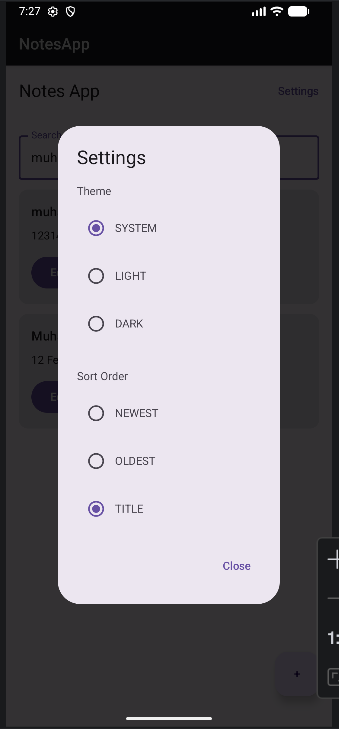

# NotesApp

**Nama:** Muharyan Syaifullah  
**NIM:** 123140045  
**Mata Kuliah:** Pengembangan Aplikasi Mobile  

## Deskripsi
NotesApp adalah aplikasi Android sederhana yang dibuat untuk memenuhi **Tugas Praktikum Minggu 7** pada mata kuliah **Pemrograman Aplikasi Mobile**.

Aplikasi ini menggunakan **SQLDelight** untuk penyimpanan data notes secara lokal dan **DataStore** untuk menyimpan pengaturan aplikasi. Aplikasi dirancang dengan konsep **offline-first**, sehingga data tetap dapat diakses meskipun tidak ada koneksi internet. Tugas minggu 7 memang meminta upgrade Notes App dengan SQLDelight, CRUD, search, settings DataStore, offline-first, dan UI states yang proper.

## Fitur
- Menyimpan notes menggunakan **SQLDelight database**
- Mendukung **CRUD operations**
  - Create note
  - Read note
  - Update note
  - Delete note
- **Search functionality** untuk mencari notes
- **Settings screen** dengan DataStore:
  - Theme
  - Sort order
- **Offline-first**, data tersimpan lokal
- UI states:
  - Loading
  - Empty
  - Content

## Teknologi yang Digunakan
- Kotlin
- Android Studio
- Jetpack Compose
- SQLDelight
- DataStore Preferences
- ViewModel
- Coroutines

## Database Schema
Aplikasi ini menggunakan tabel `Note` untuk menyimpan data notes secara lokal.

```sql
CREATE TABLE Note (
    id INTEGER NOT NULL PRIMARY KEY AUTOINCREMENT,
    title TEXT NOT NULL,
    content TEXT NOT NULL,
    created_at INTEGER NOT NULL,
    updated_at INTEGER NOT NULL
);
```

Contoh query yang digunakan:

* `selectAll`
* `selectById`
* `insert`
* `update`
* `delete`
* `search`

## Fitur Settings

Pengaturan aplikasi disimpan menggunakan **DataStore** dengan fitur:

* Theme mode
* Sort order

## Offline Mode

Aplikasi ini menerapkan konsep **offline-first**, di mana data notes disimpan dan dibaca dari local database sehingga tetap bisa digunakan tanpa koneksi internet.

## Struktur Folder

```text
com.example.notesapp
├─ data
│  ├─ local
│  ├─ repository
│  └─ settings
├─ model
├─ ui
│  ├─ screen
│  └─ state
├─ viewmodel
└─ MainActivity.kt
```

## Screenshot

### Notes List Screen



### Add Note Screen



### Edit Note Screen



### Search Feature



### Settings Screen



## Cara Menjalankan Project

1. Clone repository ini
2. Buka project di Android Studio
3. Tunggu proses Gradle Sync selesai
4. Jalankan aplikasi pada emulator atau device Android
5. Gunakan fitur tambah, edit, hapus, cari note, dan ubah settings

## Video Demo

Video demo berdurasi **45 detik** menampilkan:

* CRUD operations
* Search
* Settings
* Offline mode

## Format Pengumpulan

* Push ke GitHub repository
* Gunakan branch: `week-7`
* README berisi database schema dan screenshot semua screen
* Video demo 45 detik menunjukkan CRUD, search, settings, dan offline mode 

## Tujuan Pembelajaran

Project ini dibuat untuk memahami:

* penggunaan local storage
* penggunaan SQLDelight untuk database
* penggunaan DataStore untuk settings
* implementasi CRUD operations
* implementasi search functionality
* penerapan offline-first architecture
* pengelolaan UI states pada aplikasi notes
